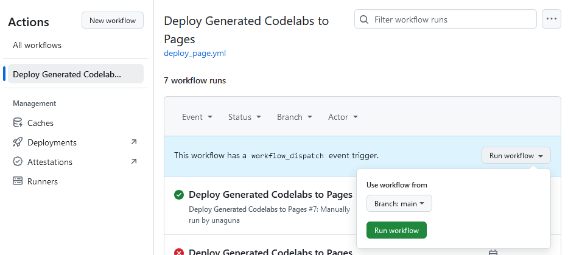
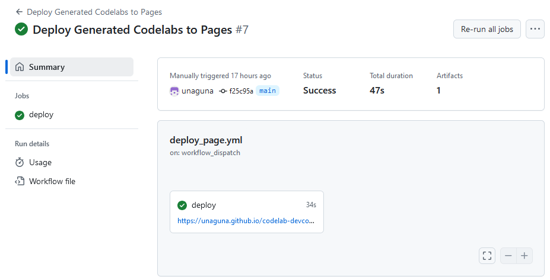

author: KOIZUMI Yusuke
summary: codelab-devcontainer の使い方の説明
id: codelab-devcontainer-usage
categories: codelab
environments: Web
status: Publish
Feedback Link: /


# codelab-devcontainer の使い方

## はじめに

codelab-devcontainer は claat を使用してこの文書のような Codelab 文書を作成する devcontainer 環境です。簡単な手順で Codelab の執筆を始められます。

この Codelab では、codelab-devcontainer を使用して Codelab 文書を作る手順を説明します。

### 前提条件

- `docker` コマンドを使用できる環境が必要です。

    - `docker version` コマンドを実行した際にクライアント情報もサーバ情報も表示されることが必要です。

- Visual Studio Code (vscode) を使用します。また、vscode の拡張機能 [Dev Containers](https://marketplace.visualstudio.com/items?itemName=ms-vscode-remote.remote-containers) を導入してください。

## 執筆環境の準備

まずは codelab-devcontainer を手元の環境に複製し、執筆を開始できる状態にしましょう。以下の手順で環境を整えます。

1. 以下のいずれかの方法で手元の環境に codelab-devcontainer を複製します。
    - codelab-devcontainer をテンプレートとして、GitHub 上に新規にリポジトリを作成する。
    - codelab-devcontainer をダウンロードする。
2. 設定ファイルを書き換えます。
3. コンテナを作成します。

これらの具体的な手順を説明します。

### 新規リポジトリの作成

この手順では、codelab-devcontainer をテンプレートとして GitHub 上に新規にリポジトリを作成することで、執筆環境を作ります。特別な設定は不要で、一般的な手順で実施します。

<aside class="negative">

現時点で GitHub 上にリポジトリを作成する予定がない場合は、この手順ではなく「テンプレートのダウンロード」を実施してください。

また、この手順を実施するとリポジトリの最初のコミットにはこの文書を作成するためのソースファイルと画像が含まれます。これを避けたい場合はこの手順を実施せず「テンプレートのダウンロード」を実施し、このステップを終えた後に git リポジトリ化してください。
</aside>

<aside class="negative">

この手順では次のことを前提としています。
- GitHub のアカウントを持っていること
- 手元の環境で `git` コマンドを使用できること
</aside>

まず GitHub にサインインした状態で [Codelab のリポジトリページ](https://github.com/unaguna/codelab-devcontainer)を開き、右上の「Use this template」をクリックします。選択肢が表示されたら「Create a new repository」をクリックします。


Create a new repository のページが表示されるため、必要事項を記入して右下の「Create repository」をクリックします。主な項目の設定値は次の通りです。

|項目|説明・設定値|
|-|-|
|Include all branches|このテンプレートではこの項目のチェックは不要です。|
<!-- |Owner|作成するリポジトリの所属です。あなたが組織に属している場合、個人と組織を選択できます。組織を選択した場合、その組織の者のみが閲覧・編集できるように設定できます。|
|Repository name|作成するリポジトリの名前を自由に設定してください。|
|Description|作成するリポジトリの説明として表示する文字列を設定してください。空欄でも構いません。後で変更することができます。|
|Public / Private|作成するリポジトリの公開範囲を選択してください。| -->

「Create repository」をクリックするとリモートリポジトリの作成が始まります。少し待つとリモートリポジトリが作成されそのページが表示されます（下図）。「Code」ボタンをクリックし、clone に使用する URL をコピーしてください。


作業環境とするディレクトリ上で以下のコマンドを実行することで、作成したリモートリポジトリをクローンしましょう。

```console
git clone <コピーしたURL>
```

### テンプレートのダウンロード

この手順では codelab-devcontainer をダウンロードして利用可能な状態にします。

<aside class="negative">

「新規リポジトリの作成」を実施した場合、この手順は不要です。
</aside>

[Codelab のリポジトリページ](https://github.com/unaguna/codelab-devcontainer)を開き、右上の「Code」をクリックし、Download ZIP をクリックすることで zip ファイルをダウンロードします。


ダウンロードが完了したら、作業環境とするディレクトリ上に zip ファイルを展開しましょう。


### 設定ファイルの書き換え・その他の下準備

手元のディレクトリ上に環境を用意できましたが、コンテナの作成の前に設定ファイルを一部書き換えます。

`.devcontainer/.env` の内容を以下のように書き換えます。

- `PROJECT_NAME` の値を、作成する Codelab の名称に変更します。この値は ZIP 出力時のファイル名等に使用されるため、半角英数字とハイフン (`-`)・アンダースコア (`_`) のみを使用することをお勧めします。

また、codelab-devcontainer を使用して作成したこのリポジトリには、この説明文書を作成するためのソースファイルが入っています。これらは新たな執筆には不要なので、以下の手順で削除しましょう。

- `src` ディレクトリの中の、拡張子が `md` のファイルと `img` ディレクトリを削除します。
    - `src/index.html` は使用するため残してください。

### コンテナの作成

次に、次の手順で作業環境となるコンテナを作成します。

1. リポジトリのディレクトリを vscode で開きます。
2. ウィンドウ左下の「><」アイコンをクリックし、表示されるメニューの「Open Folder in Container」 をクリックします。
3. コンテナの作成が開始されます。コンテナが作成されると、コンテナ内の作業ディレクトリ上で vscode が開きます。初回はイメージのビルド・コンテナ作成後の初期設定も実施されるため待ち時間が長くなります。

<aside class="positive">

次回作業時も同じ手順でコンテナを vscode で開き執筆作業に入ることができます。また、次回作業時は vscode の「Open Recent」から直接コンテナを開くこともできます。
</aside>

### コンテナ作成後の作業

おおむねコンテナ作成は自動で完了するのですが、次の作業はコンテナ作成後に手動で実施する必要があります。

- 下記のコマンドを vscode のターミナルで実行することで、リンクを作成します。

    ```console
    ln -s /workspace_local/dist /workspace/dist
    ```

### 次のステップへ

これで執筆環境が整いました。執筆を開始しましょう。

次のステップでは、codelab-devcontainer にデフォルトで設定・実装されている補助機能を説明します。

## 執筆作業

前のステップで、vscode と devcontainer を使用して執筆する準備が整いました。このステップでは、執筆作業を補助する機能を説明します。

以降の作業では、前のステップで作成したコンテナ内を vscode で開いていることを前提とします。

### リアルタイムプレビュー

vscode の拡張機能を利用して、リアルタイムにプレビューできるようにしています。自動ビルドは vscode の設定に組み込んであるため、ビルドされた HTML をリアルタイムプレビューできる Live Server を起動するだけで利用できます。


次の手順で実際に確かめてみましょう。

1. `src` ディレクトリに、Codelab のソースファイルとなる `article.md` を作成します (拡張子が `md` であればファイル名は何でも構いません)。

2. vscode で上で作成した `article.md` を開き、例えば次のような記述をします。

    ```markdown
    id: sample
    environments: Web
    status: Publish
    Feedback Link: /

    # サンプル
    ## サンプル
    サンプル
    ```

3. vscode のウィンドウ右下の「Go Live」をクリックすることで、レビュー用の Web サーバを起動する。

4. vscode のウィンドウ右下の記述が「Port: <ポート番号>」となるので、ブラウザで `http://localhost:<ポート番号>` にアクセスすると、自動で作成されたインデックスページが表示されます。「サンプル」をクリックすると上で作成した `article.md` をもとに生成された Codelab が表示されます。

5. `article.md` の内容を変更して保存すると、ブラウザが自動で更新され、最新の状態の Codelab が表示されます。

## GitHub Pages で公開

執筆した Codelab は GitHub Pages で公開することができます。このステップでは公開の手順を説明します。

<aside class="negative">

この手順では下記のことが前提になっています。

- GitHub にリポジトリをプッシュしてあること
- GitHub でリポジトリを公開状態か組織内公開状態にしている、もしくは GitHub Pro 等のプランを利用していること
    - GitHub Free プランでは、Private リポジトリで GitHub Pages を使用できません
</aside>

### GitHub Actions 有効化

codelab-devcontainer では GitHub Actions を使用して GitHub Pages をデプロイします。そのため、まずは以下の手順で GitHub Pages のデプロイ方法を設定します。

1. GitHub リポジトリのページをブラウザで開きます。
2. 「Settings」をクリックして、リポジトリの設定ページを開きます。
3. 左のメニューから「Pages」をクリックします。
4. 「Source」プルダウンメニューから「GitHub Actions」をクリックします。
5. 画面上部に「GitHub Pages source saved.」のように表示されたら設定完了です。

### デプロイワークフローの編集

codelab-devcontainer の初期設定では、GitHub Actions でデプロイワークフローを手動で起動したときにデプロイされます。main ブランチの更新時に自動でデプロイされるようにしたい場合、`./github/workflows/deploy_page.yml` を次のように編集して、main ブランチにプッシュしてください。

- `on.push` についているコメントアウトを外して以下のようにする。

    ```yaml
    on:
      # Runs on pushes targeting the default branch
      push:
        branches: ["main"]

      # Allows you to run this workflow manually from the Actions tab
      workflow_dispatch:
    ```

### 手動デプロイ

上のステップで `on.push` を有効にしていると自動でデプロイされるようになりますが、手動でデプロイすることもできます。手動デプロイは以下の手順で実施します。

1. GitHub リポジトリのページをブラウザで開きます。
2. 「Actions」をクリックして、GitHub Actions の操作画面を開きます。
3. 左のメニューから「Deploy Generated Codelabs to Pages」をクリックします。
4. 「Run workflow」プルダウンをクリックし、「Run workflow」ボタンをクリックすると、デプロイが開始します。
    
5. 進捗は画面で確認できます。完了するとページへのリンクが表示されます。
    

## ZIP アーカイブ化

GitHub Pages 以外の方法で公開したり他の人へ共有するために、codelab-devcontainer では生成した Codelab やこのプロジェクトそのものを zip にする機能が用意されています。

### Codelab の zip 化

vscode のターミナルを起動して以下のコマンドを実行しましょう。`build` ディレクトリ内に ZIP ファイルが生成されます。

```console
./tools/enzip_dist.sh
```

### 執筆環境の zip 化

vscode のターミナルを起動して以下のコマンドを実行することで、このプロジェクトを ZIP 圧縮したものが `build` ディレクトリ内に生成されます。

```console
./tools/enzip.sh
```

