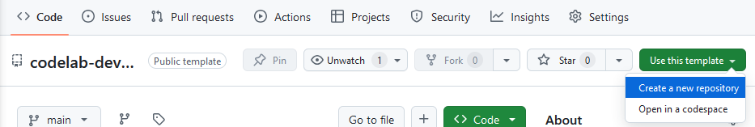
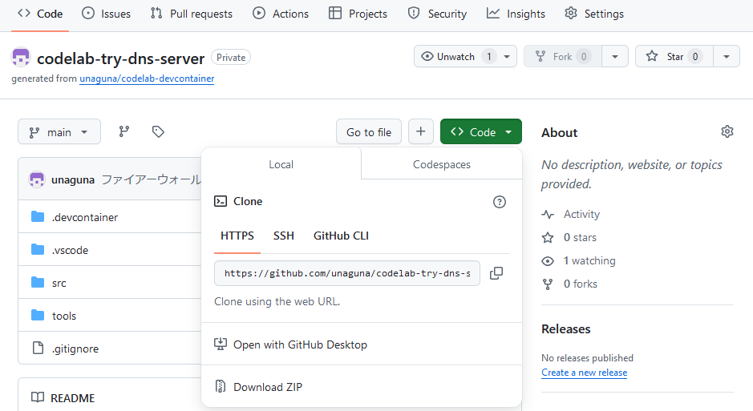
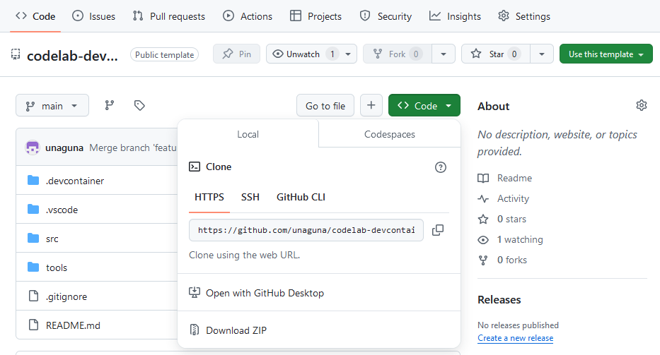

author: KOIZUMI Yusuke
summary: codelab-devcontainer の使い方の説明
id: codelab-devcontainer-usage
categories: codelab
environments: Web
status: Publish
Feedback Link: /


# codelab-devcontainer の使い方

## はじめに

codelab-devcontainer は claat を使用してこの文書のような Codelab 文書を作成する devcontainer 環境です。簡単な手順で Codelab の執筆を始められます。

この Codelab では、codelab-devcontainer を使用して Codelab 文書を作る手順を説明します。

### 前提条件

- `docker` コマンドを使用できる環境が必要です。

    - `docker version` コマンドを実行した際にクライアント情報もサーバ情報も表示されることが必要です。

- Visual Studio Code (vscode) を使用します。また、vscode の拡張機能 [Dev Containers](https://marketplace.visualstudio.com/items?itemName=ms-vscode-remote.remote-containers) を導入してください。

## 執筆環境の準備

まずは codelab-devcontainer を手元の環境に複製し、執筆を開始できる状態にしましょう。以下の手順で環境を整えます。

1. 以下のいずれかの方法で手元の環境に codelab-devcontainer を複製します。
    - codelab-devcontainer をテンプレートとして、GitHub 上に新規にリポジトリを作成する。
    - codelab-devcontainer をダウンロードする。
2. 設定ファイルを書き換えます。
3. コンテナを作成します。

これらの具体的な手順を説明します。

### 新規リポジトリの作成

この手順では、codelab-devcontainer をテンプレートとして GitHub 上に新規にリポジトリを作成することで、執筆環境を作ります。特別な設定は不要で、一般的な手順で実施します。

<aside class="negative">

現時点で GitHub 上にリポジトリを作成する予定がない場合は、この手順ではなく「テンプレートのダウンロード」を実施してください。

また、この手順を実施するとリポジトリの最初のコミットにはこの文書を作成するためのソースファイルと画像が含まれます。これを避けたい場合はこの手順を実施せず「テンプレートのダウンロード」を実施し、このステップを終えた後に git リポジトリ化してください。
</aside>

<aside class="negative">

この手順では次のことを前提としています。
- GitHub のアカウントを持っていること
- 手元の環境で `git` コマンドを使用できること
</aside>

まず GitHub にサインインした状態で [Codelab のリポジトリページ](https://github.com/unaguna/codelab-devcontainer)を開き、右上の「Use this template」をクリックします。選択肢が表示されたら「Create a new repository」をクリックします。



Create a new repository のページが表示されるため、必要事項を記入して右下の「Create repository」をクリックします。主な項目の設定値は次の通りです。

|項目|説明・設定値|
|-|-|
|Include all branches|このテンプレートではこの項目のチェックは不要です。|
<!-- |Owner|作成するリポジトリの所属です。あなたが組織に属している場合、個人と組織を選択できます。組織を選択した場合、その組織の者のみが閲覧・編集できるように設定できます。|
|Repository name|作成するリポジトリの名前を自由に設定してください。|
|Description|作成するリポジトリの説明として表示する文字列を設定してください。空欄でも構いません。後で変更することができます。|
|Public / Private|作成するリポジトリの公開範囲を選択してください。| -->

「Create repository」をクリックするとリモートリポジトリの作成が始まります。少し待つとリモートリポジトリが作成されそのページが表示されます（下図）。「Code」ボタンをクリックし、clone に使用する URL をコピーしてください。



作業環境とするディレクトリ上で以下のコマンドを実行することで、作成したリモートリポジトリをクローンしましょう。

```console
git clone <コピーしたURL>
```

### テンプレートのダウンロード

この手順では codelab-devcontainer をダウンロードして利用可能な状態にします。

<aside class="negative">

「新規リポジトリの作成」を実施した場合、この手順は不要です。
</aside>

[Codelab のリポジトリページ](https://github.com/unaguna/codelab-devcontainer)を開き、右上の「Code」をクリックし、Download ZIP をクリックすることで zip ファイルをダウンロードします。



ダウンロードが完了したら、作業環境とするディレクトリ上に zip ファイルを展開しましょう。


### 設定ファイルの書き換え・その他の下準備

手元のディレクトリ上に環境を用意できましたが、コンテナの作成の前に設定ファイルを一部書き換えます。

`.devcontainer/.env` の内容を以下のように書き換えます。

- `PROJECT_NAME` の値を、作成する Codelab の名称に変更します。この値は ZIP 出力時のファイル名等に使用されるため、半角英数字とハイフン (`-`)・アンダースコア (`_`) のみを使用することをお勧めします。

また、codelab-devcontainer を使用して作成したこのリポジトリには、この説明文書を作成するためのソースファイルが入っています。これらは新たな執筆には不要なので、以下の手順で削除しましょう。

- `src` ディレクトリの中の、拡張子が `md` のファイルと `img` ディレクトリを削除します。
    - `src/index.html` は使用するため残してください。

### コンテナの作成

次に、次の手順で作業環境となるコンテナを作成します。

1. リポジトリのディレクトリを vscode で開きます。
2. ウィンドウ左下の「><」アイコンをクリックし、表示されるメニューの「Open Folder in Container」 をクリックします。
3. コンテナの作成が開始されます。コンテナが作成されると、コンテナ内の作業ディレクトリ上で vscode が開きます。初回はイメージのビルド・コンテナ作成後の初期設定も実施されるため待ち時間が長くなります。

### 次のステップへ

これで執筆環境が整いました。執筆を開始しましょう。

次のステップでは、codelab-devcontainer にデフォルトで設定・実装されている補助機能を説明します。
